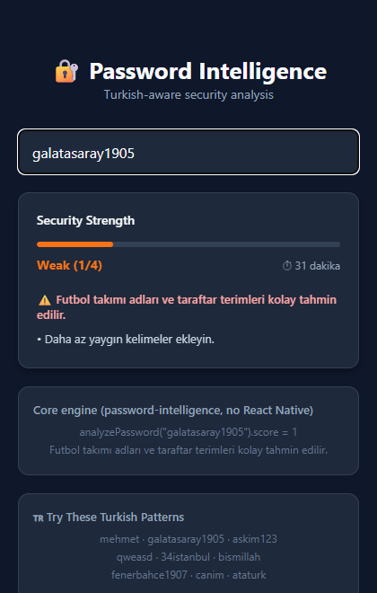

<div align="center">

# Password Intelligence

**Turkish-first, culturally-aware password strength kit for React Native.**  
*Wraps the zxcvbn-ts engine with a Turkish-specific threat layer.*

[](https://www.npmjs.com/package/react-native-password-intelligence)
[](https://www.npmjs.com/package/react-native-password-intelligence)
[](https://bundlephobia.com/package/react-native-password-intelligence)
[](https://github.com/mobilteknolojileri/react-native-password-intelligence/actions)
[](https://codecov.io/gh/mobilteknolojileri/react-native-password-intelligence)
[](https://scorecard.dev/viewer/?uri=github.com/mobilteknolojileri/react-native-password-intelligence)
[](https://www.typescriptlang.org/)
[](./LICENSE)
[](https://reactnative.dev/)
[](https://reactnative.directory/package/react-native-password-intelligence)



### [▶ Try it live](https://mobilteknolojileri.github.io/react-native-password-intelligence/)

**English** · [Türkçe](./README.tr.md)

</div>

---

## Contents

- [The mission](#the-mission-regional-intelligence)
- [Installation](#installation)
- [Quick start](#quick-start)
- [Contextual intelligence](#contextual-intelligence)
- [API reference](#api-reference)
- [Score scale](#score-scale)
- [Standards](#standards)
- [What this is not](#what-this-is-not)
- [Comparison](#comparison)
- [Engineering details](#engineering-details)
- [Migration & changelog](#migration--changelog)
- [Security](#security)
- [Contributing](#contributing)
- [License](#license)

---

## The Mission: Regional Intelligence

Standard password meters treat `password123` as weak but often miss regional patterns like `mehmet1907`, `karakartal`, or `askim34`. These "cultural" passwords are among the most common found in regional data breaches.

**Password Intelligence** wraps the industry-standard [zxcvbn-ts](https://github.com/zxcvbn-ts/zxcvbn) engine and adds a Turkish-specific intelligence layer. Today it ships one locale (Turkish) deeply, not many locales superficially — see [Engineering details](#engineering-details) for the architecture rationale.

### Turkish intelligence layer

| Category | Detections & examples |
|---|---|
| Common names | `mehmet`, `ayşe`, `fatma`, `burak`, `memo`, `nizipliibo` |
| Common surnames | `yılmaz`, `kaya`, `demir`, `çelik`, `öztürk` (382 entries from TÜİK / NVI) |
| Football culture | Major clubs (`cimbom`, `fenerbahçe`, `beşiktaş`) and fan terms |
| City plate patterns | Plate codes (`34`, `06`, `27`) and city names (`istanbul34`, `ankara06`) |
| Cultural / historic | `atatürk`, `1453`, `1923`, `cumhuriyet`, `türkiye` |
| Romantic & social | `aşkım`, `canım`, `hayatım`, `birtanem` |
| Religious / ideological | Threat-intel category — terms observed in Turkish breach corpora |
| Zodiac signs | `koç`, `aslan`, `başak`, `akrep`, `oğlak` |
| Brands | `turkcell`, `akbank`, `trendyol`, `migros`, `getir` |
| Keyboard walks | `qweasd`, `asdfgh`, `qazwsx`, `1qaz2wsx` |
| Common passwords | `şifre`, `parola`, `admin`, `qwerty`, `123456` |

Every entry is generated in Turkish, compact and ASCII-folded variants, and the password gets a targeted case repair whenever Unicode default casing would miss a Turkish word — so `İSTANBUL34` (Turkish keyboard), `IBRAHIM` (English keyboard) and all-caps `ŞANLIURFA` are all flagged. Custom dictionary words and `userInputs` go through the same fold.

---

## Installation

| You are building | Install |
|---|---|
| React Native / Expo app | `react-native-password-intelligence` |
| Node backend, Next.js, plain React, CLI | [`password-intelligence`](https://www.npmjs.com/package/password-intelligence) (no react/react-native dependency) |

Both ship the same engine; the React Native package is a thin wrapper that adds `usePasswordRisk`
and `<PasswordMeter />` and re-exports the entire core surface.


```bash
yarn add react-native-password-intelligence
# or
npm install react-native-password-intelligence
```

Peer requirements:

- React `>=18.0.0`
- React Native `>=0.74.0`
- Node (for development) `>=18`

`@zxcvbn-ts/core` is pulled in automatically. `@zxcvbn-ts/language-common` is optional — install it only if you restore the full English list via `configure()`. No native code or Expo plugin is required.

---

## Quick Start

### 1. Animated UI component

```tsx
import { PasswordMeter } from 'react-native-password-intelligence';

<PasswordMeter password={password} />;
```

### 2. Headless hook

```tsx
import { usePasswordRisk } from 'react-native-password-intelligence';

const { score, crackTimeDisplay, feedback } = usePasswordRisk(password);
```

### 3. Pure analysis (non-React)

```ts
import { analyzePassword } from 'react-native-password-intelligence';

const result = analyzePassword('galatasaray1905');
console.log(result.score); // 0 | 1 | 2 | 3 | 4
```

---

## Contextual Intelligence

### Per-call user inputs

Pass user-specific values (name, email, username) so they are penalized when they appear in the password.

```tsx
// Hook
const { score } = usePasswordRisk(password, [
  user.firstName,
  user.lastName,
  user.email,
]);

// Pure function
analyzePassword('mehmetyilmaz1907', ['Mehmet', 'Yılmaz']);

// UI component
<PasswordMeter
  password={password}
  userInputs={[user.firstName, user.email]}
/>;
```

### Global custom dictionary

Inject brand names or company-wide forbidden words once at startup. The list is deduplicated and capped at 10,000 entries.

```ts
import {
  addCustomDictionary,
  clearCustomDictionary,
} from 'react-native-password-intelligence';

// App entry point
addCustomDictionary(['Acme', 'AcmeCorp', 'AcmePay']);

// Tests / multi-tenant SSR
clearCustomDictionary();
```

---

## API Reference

### `analyzePassword(password, userInputs?)`

Pure function. Initializes zxcvbn on first call, then synchronous on subsequent calls.

```ts
analyzePassword(
  password: string,
  userInputs?: readonly (string | number)[]
): ZxcvbnResult
```

| Field | Type | Notes |
|---|---|---|
| `password` | `string` | Non-string values are coerced to `''`. Input is normalised to NFC, and anything past 256 characters is truncated. |
| `userInputs` | `readonly (string \| number)[]` | Optional. Per-call values penalised alongside the global custom dictionary; strings are matched in Turkish, compact and ASCII-folded forms. |

Returns the full [`ZxcvbnResult`](https://github.com/zxcvbn-ts/zxcvbn) with `score`, `feedback`, `crackTimesDisplay`, `crackTimesSeconds`, `guesses`, `sequence`, etc.

### `usePasswordRisk(password, userInputs?)`

React hook. Memoized by value (not reference), so consumers can pass inline arrays without infinite re-renders. It also subscribes to the engine configuration, so a `configure()` or `addCustomDictionary()` call that lands after the first render re-analyses the password on screen instead of leaving a stale score.

```ts
usePasswordRisk(
  password: string,
  userInputs?: readonly (string | number)[]
): {
  score: 0 | 1 | 2 | 3 | 4;
  feedback: { warning: string | null; suggestions: string[] };
  crackTimeDisplay: string;
  raw: ZxcvbnResult;
}
```

### `<PasswordMeter />`

Animated 4-step progress bar. Two prop variants — provide either `password` (auto-analyzed) **or** `score` (pre-computed). Supplying neither is a TypeScript error. The pre-computed-score variant intentionally bypasses the analyzer entirely so consumers who already have a score (e.g., from a server) pay no zxcvbn initialization cost.

```ts
type PasswordMeterProps =
  | { password: string; userInputs?: readonly (string | number)[]; score?: never }
  | { score: 0 | 1 | 2 | 3 | 4; password?: never; userInputs?: never };
// plus optional `style?: StyleProp<ViewStyle>` and `barHeight?: number` (default 6)
```

### `addCustomDictionary(words)`

Idempotent. Adds entries to a deduplicated global `Set`. Past 10,000 entries the addition is rejected and a `console.warn` is emitted.

```ts
addCustomDictionary(words: readonly string[]): void
```

### `configure(config)`

Swaps dictionaries, keyboard graphs, translations or limits. Valid at any time — including after
the first analysis — because options are re-applied lazily on the next call.

```ts
import { configure } from 'react-native-password-intelligence';

// Restore the full 49,233-entry English list (adds ~229 kB gzip to your bundle)
const { dictionary, adjacencyGraphs } = await import('@zxcvbn-ts/language-common');
configure({ dictionaries: dictionary, graphs: adjacencyGraphs });
```

| Option | Purpose |
|---|---|
| `dictionaries` | Extra zxcvbn dictionaries, merged over the bundled ones key by key |
| `graphs` | Extra keyboard adjacency graphs, merged over the bundled ones layout by layout |
| `translations` | Replaces the bundled Turkish feedback strings. Any `@zxcvbn-ts/language-*` translations object works; add a `dictionaryWarnings` map (keyed by dictionary name) to translate the Turkish-category warnings too, otherwise those matches return `warning: null` rather than mixing languages |
| `disableTurkishDictionaries` | Ship only the English list |
| `disableBundledPasswords` | Ship only the Turkish categories |
| `maxLength` | Characters analysed before truncation (default 256, matching `@zxcvbn-ts/core`) |
| `useLevenshteinDistance`, `levenshteinThreshold` | Passed through to zxcvbn |

`configure()` validates synchronously and throws a `TypeError` / `RangeError` on an invalid option (`maxLength` must be a positive integer, `translations` must contain every zxcvbn key, dictionaries must be arrays, …) without touching the current configuration.

### `resetConfiguration()`

Reverts everything set via `configure()`. Deliberately does **not** clear the custom dictionary —
that is `clearCustomDictionary()`'s job.

### `subscribeToConfiguration(listener)` / `getConfigurationVersion()`

Change notifications for the module-global engine state (`configure`, `resetConfiguration`,
`addCustomDictionary`, `clearCustomDictionary`). `usePasswordRisk` uses them internally; reach for
them only if you cache `analyzePassword` results yourself.

```ts
subscribeToConfiguration(listener: () => void): () => void; // returns unsubscribe
getConfigurationVersion(): number; // monotonic counter
```

### `clearCustomDictionary()`

Resets the global custom dictionary. Intended for test isolation and multi-tenant SSR.

```ts
clearCustomDictionary(): void
```

---

## Score scale

The scale is zxcvbn-ts's 0–4 band, derived from estimated guess counts rather than character composition rules.

| Score | Label | Color | UX meaning |
|:---:|:---|:---|:---|
| 0 | Very Weak | Red `#ef4444` | Trivially guessable |
| 1 | Weak | Orange `#f97316` | Common pattern detected |
| 2 | Fair | Yellow `#eab308` | Basic protection |
| 3 | Good | Lime `#84cc16` | Resists offline guessing |
| 4 | Strong | Green `#22c55e` | Robust & pattern-free |

---

## Standards

NIST SP 800-63B-4 §3.1.1.2 *Password Verifiers*
([HTML](https://pages.nist.gov/800-63-4/sp800-63b.html#passwordver) ·
[DOI](https://doi.org/10.6028/NIST.SP.800-63b-4)) requires that *"verifiers SHALL compare the
prospective secret against a blocklist that contains known commonly used, expected, or compromised
passwords."* **Dictionary words** and **context-specific words, such as the name of the service,
the username, and derivatives thereof** appear there as example entries — the standard's wording is
*"For example, the list may include…"*, not a mandated set. Verifiers must also *"offer guidance to
the subscriber to help the subscriber choose a strong password."*

One sentence in that section matters more than the rest for a library like this one:

> *"The entire password SHALL be subject to comparison, not substrings or words that might be
> contained therein."*

zxcvbn is a substring and pattern matcher by construction, which is the opposite of the
whole-password membership test §3.1.1.2 prescribes. So be precise about what you get:

| 800-63B-4 §3.1.1.2 asks for | This library |
|---|---|
| Whole-password comparison against a blocklist | **Does not do this.** No client-side scorer can. Run it verifier-side; the corpora here are a reasonable input to one. |
| Context-specific words (username, service name, derivatives) | `userInputs` per call, `addCustomDictionary` globally — as scoring signals, not as a blocklist |
| Guidance to the subscriber | Turkish `feedback.warning` and `feedback.suggestions` |

**It does not make you compliant.** 800-63B places the check on the *verifier*; this runs
client-side and returns a score, it does not reject anything. Enforcement must happen server-side.
Note also that §3.1.1.2 item 5 states *"Verifiers and CSPs SHALL NOT impose other composition rules
(e.g., requiring mixtures of different character types) for passwords"* (§3.1.1.1 puts it as
*"Other composition requirements for passwords SHALL NOT be imposed."*) — so do not layer
character-class rules on top of this score.

---

## What this is not

- **Not a password manager** — does not store, transmit, or sync passwords.
- **Not a hash function** — does not produce or verify hashes. Pair with **Argon2id** (described in [RFC 9106](https://www.rfc-editor.org/rfc/rfc9106.html), an Informational IRTF/CFRG document rather than a standards-track spec), or scrypt, per the [OWASP Password Storage Cheat Sheet](https://cheatsheetseries.owasp.org/cheatsheets/Password_Storage_Cheat_Sheet.html); PBKDF2 when FIPS-140 validation is required, and bcrypt only for legacy systems.
- **Not a generator** — does not produce passwords. Use a CSPRNG-backed generator for that.
- **Not a server-side validator** — runs in the React Native runtime (or any JS runtime). The score is a UX hint, not a server-side authorization gate.

---

## Comparison

| | this library | `@zxcvbn-ts/core` + [`language-tr`](https://www.npmjs.com/package/@zxcvbn-ts/language-tr) | `zxcvbn` (Dropbox) | `react-native-password-strength-meter` |
|---|:---:|:---:|:---:|:---:|
| Guess-count scoring | ✅ | ✅ | ✅ | ❌ character-class heuristic |
| Turkish names, cities, major clubs | ✅ | ✅ | ❌ | ❌ |
| ASCII-folded variants (`fenerbahce`, `ataturk`, `yilmaz`) | ✅ | ❌ | ❌ | ❌ |
| Plate codes, club slang (`cimbom`), brand corpus | ✅ | ❌ | ❌ | ❌ |
| Turkish-locale case repair (`İ` / `I`) | ✅ | ❌ | ❌ | ❌ |
| Turkish feedback strings | ✅ | ✅ | ❌ | ❌ |
| React Native UI component | ✅ | ❌ | ❌ | ✅ |
| Headless React hook | ✅ | ❌ | ❌ | ❌ |
| Per-call user inputs | ✅ | ✅ | ✅ | ❌ |
| Global custom dictionary API | ✅ | ⚠️ constructor options | ❌ | ❌ |
| Framework-agnostic core package | ✅ | ✅ | ✅ | ❌ |
| Published with npm provenance | ✅ | ❌ | ❌ | ❌ |
| Turkish + common-password bundle | **~37 kB gzip** | ~400 kB gzip | ~400 kB gzip | n/a |
| Latest release | — | 2026-08 | **2017-02** | **2020-11** |

Two rows deserve their footnotes rather than a checkmark.

**We wrote `@zxcvbn-ts/language-tr`** ([PR #315](https://github.com/zxcvbn-ts/zxcvbn/pull/315)), so
the Turkish rows above are not a competitor catching up — they are the same author's upstream work.
That pack gives zxcvbn 30,000 Turkish frequency words, 10,000 Wikipedia titles, 1,794 first names,
198 surnames and Turkish feedback strings. What it deliberately does not do is fold `fenerbahçe` to
`fenerbahce`, know that `cimbom` means Galatasaray or that `34` means İstanbul, or carry a brand
corpus. This library is the layer above it — and it costs ~37 kB instead of ~400 kB, because it
vendors a 4,000-entry slice instead of the full common-password list.

**There is no "long-input DoS guard" row**, because the honest version of that claim is too narrow
to be a feature comparison: `@zxcvbn-ts/core` has had a `maxLength` option (default **256**, i.e.
stricter than ours) since v2.2.1. See *Long-input safety* under
[Engineering details](#engineering-details) for what this library actually does and why.

---

## Engineering details

- **Deferred initialization** — zxcvbn options (translations, dictionaries) register on the first `analyzePassword` call, not at import time. A screen that never analyzes a password pays no setup cost.
- **~37 kB gzip, not 236 kB** — the core package vendors a frequency-ordered top-4,000 English password list (measured by `scripts/check-size.mjs` on the ESM output; `@zxcvbn-ts/core` adds ~20 kB either way) instead of pulling in the full 49,233-entry `@zxcvbn-ts/language-common` (229 kB gzip). `configure()` restores full coverage when you want it. Until 0.4.0 that dependency was a static import in the root entry chain, so `sideEffects: false` could not remove it — deferring the *call* does not defer the *import*, and Metro does not tree-shake at all.
- **Tree-shakeable** — `sideEffects: false`, so bundlers that support it can drop the UI component and hook for consumers who only import `analyzePassword`. On React Native, install `password-intelligence` instead to skip them entirely.
- **Long-input safety** — passwords longer than 256 characters are truncated before zxcvbn sees
  them. This is load-bearing rather than redundant: `@zxcvbn-ts/core` v3 does have its own
  `maxLength`, but applies it only inside `zxcvbnAsync`, so the synchronous `zxcvbn()` this library
  calls receives the raw string. Note that the cap bounds the worst case, it does not make long
  inputs cheap — see [Performance notes](#performance-notes) for what length actually costs.
- **Targeted Turkish case repair** — the password is scored *as typed*, so uppercase entropy and zxcvbn's capitalization feedback survive. Unicode default casing breaks matching in two places — the dotted capital `İ` (mapped to `i` + U+0307) and an ASCII `I` next to other Turkish letters (`ŞANLIURFA` lowercases to `şanliurfa`, which is neither `şanlıurfa` nor `sanliurfa`) — so only such inputs get an ASCII-folded second pass. The lower score wins, and `result.password` echoes the NFC-normalised input.
- **Turkish feedback by default** — warning and suggestion strings are returned in Turkish, matching the dictionary intelligence, and Turkish dictionary matches explain themselves (team, city, brand, …) under the same rule zxcvbn applies to its own warnings: never for a password that already scores 3 or 4. To use English, install `@zxcvbn-ts/language-en` and pass its `translations` to `configure()`.
- **Industry-grade tests** — 230+ tests gated at 85% lines / 80% functions / 75% branches, plus a CI gzip budget and a tarball-contents check. A 30-input score-regression snapshot guards against accidental drift in dictionary or scoring updates.
- **Strict TypeScript** — `strict`, `exactOptionalPropertyTypes`, `noUncheckedIndexedAccess`, `noImplicitOverride`, `noPropertyAccessFromIndexSignature`, `isolatedModules`, `useDefineForClassFields`.
- **Zero native code** — pure JavaScript, works on Expo, iOS, Android, and Web.
- **Single-locale today** — the architecture is one Turkish dictionary deeply, not a plugin system. `configure({ dictionaries })` already lets you add any locale's corpus at runtime; a first-class locale-plugin abstraction is on the 1.0.0 roadmap.

### Performance notes

zxcvbn's matcher cost grows steeply with input length, and that dominates everything else. Median
of ten distinct random inputs per length, warmed, Node 22 on a desktop, at the default
`maxLength` of 256:

| Length | 8 | 16 | 32 | 64 | 128 | 256 and beyond |
|---|---|---|---|---|---|---|
| Median | 0.4 ms | 2.7 ms | 82 ms | 190 ms | 409 ms | ~890 ms |

The last column is flat because anything past `maxLength` is truncated — a 4,096-character paste
costs the same as a 256-character one. Raising the cap removes that ceiling: the same measurement
at `maxLength: 1024` was **6.6 s** per call, which is why the default no longer sits there.

- **Budget for this.** A 64-character password out of a password manager costs ~190 ms per call on
  a desktop, and a mid-range Android phone is several times slower. `usePasswordRisk` is
  synchronous and does **not** debounce, so that cost lands on every keystroke. If your form
  accepts long passwords, debounce the value before you pass it in; an opt-in `debounceMs` is on
  the 1.0.0 roadmap.
- First `analyzePassword` call in a fresh process: ~38 ms (zxcvbn options registration + dictionary
  build). Re-applying options after `configure()` costs ~1 ms for the bundled dictionaries and
  ~15 ms for the full `language-common` set.
- The Turkish case-repair second pass roughly doubles the cost of the inputs that trigger it, which
  are rare — pure-ASCII input never does.
- Dictionary footprint: 12 Turkish categories (~5 kB gzip) + 4,000 common passwords (~17 kB gzip) + 6 keyboard layouts (~3 kB gzip).
- The hook memoizes by the JSON-stringified value of `(password, userInputs)`, so re-renders with the same input cost a single `JSON.parse`.

---

## Migration & Changelog

Upgrade notes (including the 0.3.x → 0.4.0 migration and how to switch the feedback language) live in [CHANGELOG.md](./CHANGELOG.md). Architecture rationale is in [ARCHITECTURE.md](./ARCHITECTURE.md).

## Security

Disclosure process and supported versions: [SECURITY.md](./SECURITY.md).

## Contributing

Contributions for new dictionary entries, surname-list updates, or bug fixes are welcome — see [CONTRIBUTING.md](./CONTRIBUTING.md). For repo-wide commit hygiene see [COMMIT_CONVENTION.md](./COMMIT_CONVENTION.md).

## Roadmap

1.0.0 goals and what is explicitly out of scope: [ROADMAP.md](./ROADMAP.md).

## License

MIT © [mobilteknolojileri](https://github.com/mobilteknolojileri)
